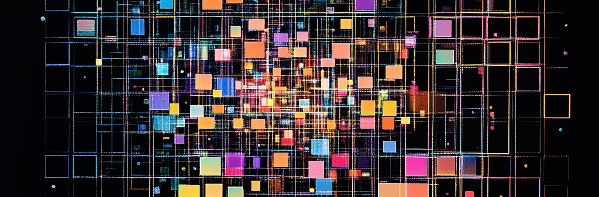

investigations into the ARC challenge
-------------------------------------

**contents**

- questions_
- mission_
- priors_
- code_
- research_
- installation_
- usage_

This project is a collection of studies inspired by the Abstraction and
Reasoning Corpus (ARC) - a set of puzzles designed to be easy for humans
to solve - but difficult for AI. 

The ARC challenge presents a fundamental test
of machine intelligence through pattern recognition and reasoning. This project
provides a systematic approach to analyzing and solving ARC puzzles, with a focus
on geometric patterns and transformations.

For more information on ARC and the current contest, check out https://arcprize.org

I began my journey with ARC thinking that it might be fun to "engineer" a system that
could solve these puzzles. But I soon realized the intention in `On the Measure of Intelligence`_ is for an agent to address the puzzles with
no previous knowledge about the puzzles. If I were to design a system (if I could) then I would be demonstrating my
intelligence - not that of an agent.

.. _On the Measure of Intelligence: https://arxiv.org/pdf/1911.01547

questions
---------

We are guided by several important questions around the use of LLMs to 

- **Can an LLM solve an ARC puzzle with understanding?**

  We know that LLMs can solve ARC puzzles in many different ways, but the LLM 

- **Can an LLM perceive the elements of the puzzle?**

- **Can an LLM discern the "story" of the puzzle?**

priors
------

To successfully tell the story, an intelligent agent would need to be able to
perceive and discern the following qualities of a puzzle:

    - **Objectness**

      Objects persist and cannot appear or disappear without reason. Objects can interact or not depending on the circumstances.

    - **Goal-directedness**

      Objects can be animate or inanimate. Some objects are "agents" - they have intentions and they pursue goals.

    - **Numbers & counting**

      Objects can be counted or sorted by their shape, appearance, or movement using basic mathematics like addition, subtraction, and comparison.

    - **Basic geometry & topology**

      Objects can be shapes like rectangles, triangles, and circles which can be
      mirrored, rotated, translated, deformed, combined, repeated, etc.
      Differences in distances can be detected.

    -- from https://arcprize.org/arc

mission
-------
To achieve our goal, we want to see the endeavor as a partnership with the
intelligent agent. We want to learn about the nature of the agent, so that we
can facilitate the puzzles in the most advantageous way.

- raise an intelligent **agent** to participate in the ARC challenge
- facilitate the investigation of the ARC puzzles with the **agent**
- focus on extracting a **natural language program** for each puzzle
- give the agent a set of actions to perform to complete the puzzle
- recognize all the variables in the system and test for them
- log process

An important consideration, the agent cannot experience the puzzle as a human
does, so we must find ways to augment perception.

code
----

Most of the logic of the ``geometor.arcprize`` package is in 3 submodules:

Check out the documentation here: https://geometor.github.io/arcprize/modules/

- ``geometor.arcprize.puzzles``: 
  
  tools for reading source json for ARC puzzles and facilitating presentation to
  the agent

  also tools for sorting puzzle list by complexity

- ``geometor.arcprize.solvers``: 
  
  currently code for facilitating puzzle solutions with the Gemini API

  logging and client management

- ``geometor.arcprize.perception``: 

research
--------

I have been collecting links and summary of papers, repos, youtube videos, and
other web pages related to ARC. 

https://geometor.github.io/arcprize/refs/

I hope to improve the usefulness of this data over time. 

    **NOTE:**

    the search feature on the website is excellent

Please recommend any additional references. 

installation
------------

Until we deploy to pypi, we recommend installing from the project root

this should install required packages as well as ``geometor.model``

.. code-block:: bash

    pip install -e .

usage
-----

the following is the current script for running the **first six** sessions at
arcprizesessions_

.. _arcprizesessions: https://github.com/geometor/arcprizesessions

.. code-block:: python

   from rich import print
   from datetime import datetime
   from pathlib import Path
   import json
   import os

   from geometor.arcprize.puzzles import Puzzle, PuzzleSet, Grid
   from geometor.arcprize.solvers.gemini_solver import PuzzleSolver

   def solve_all_puzzles(puzzle_set, model_name):
       timestamp = datetime.now().strftime("%y.%j.%H%M%S")
       for puzzle in puzzle_set.puzzles:
           solver = PuzzleSolver(
               puzzle,
               timestamp=timestamp,
               output_dir="../docsrc",
               model_name=model_name,
               max_iterations=10,
           )
           solver.solve()

   def run():
       puzzle_set = PuzzleSet()
       print(f"Loaded {len(puzzle_set.puzzles)} puzzles")

       #  model_name = "gemini-exp-1121"
       #  model_name = "models/gemini-exp-1114"
       model_name = "models/gemini-1.5-flash-002"

       #  solve_all_puzzles(puzzle_set, model_name)

       timestamp = datetime.now().strftime("%y.%j.%H%M%S")
       solver = PuzzleSolver(
           puzzle_set.puzzles[0],
           timestamp=timestamp,
           output_dir="../docsrc",
           model_name=model_name,
           max_iterations=10,
       )
       solver.solve()

   if __name__ == "__main__":
       run()

Running Perception Tests
~~~~~~~~~~~~~~~~~~~~~~~

.. code-block:: python

    from geometor.arcprize.perception import generate_puzzle_set
    from geometor.arcprize.perception.experiment_runner import test_individual_puzzles

    # Generate test puzzles
    puzzles = generate_puzzle_set(
        num_puzzles=10,
        min_size=3,
        max_size=5,
        symbol_set_key="digits"
    )

    # Run tests
    results = test_individual_puzzles(puzzles, model="phi-3")

contributing
------------

Contributions are welcome! Please read our Contributing Guidelines for details on
the process for submitting pull requests.

- New perception test types
- Additional solver strategies
- Visualization improvements
- Documentation enhancements
- Performance optimizations

.. |ytimg| image::  https://img.youtube.com/vi/CMr2NoIaZn8/2.jpg
   :target: https://www.youtube.com/watch?v=CMr2NoIaZn8

.. list-table::

   * - |ytimg|
     - https://www.youtube.com/watch?v=CMr2NoIaZn8 - 

       all the grids from the training puzzles in order of complexity

license
-------

This project is licensed under the MIT License - see the LICENSE file for details.

contact
-------

:GitHub: `@phiarchitect <https://github.com/phiarchitect>`_
:Project: `GEOMETOR <https://github.com/geometor>`_
:website: 

    This project is part of the GEOMETOR initiative, exploring fundamental
    patterns and relationships in mathematics and nature.
