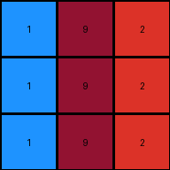

005 • History
=============


.. meta::
   :puzzle_id: 4-0d3d703e
   :timestamp: 24.305.013736
   :call_count: 5

Begin puzzle: 4-0d3d703e

**example_1**

**input**


.. code-block::

    [[3 1 2]
     [3 1 2]
     [3 1 2]]


.. image:: _images/005-1.png
   :alt: Grid visualization
   :align: center

**output**


.. code-block::

    [[4 5 6]
     [4 5 6]
     [4 5 6]]


.. image:: _images/005-2.png
   :alt: Grid visualization
   :align: center

**observations**

```text
input:
  width: 3
  height: 3
  colors:
    - 1: (3) blue
    - 2: (3) red
    - 3: (3) green
  objects:
    - 3 columns of single color pixels repeating across rows
output:
  width: 3
  height: 3
  colors:
    - 4: (3) yellow
    - 5: (3) gray
    - 6: (3) magenta
  objects:
    - 3 columns of single color pixels repeating across rows
differences:
  cells_changed: 9
  colors_changed: all colors in output incremented by 3 from input
transformation:
  - add 3 to each cell value
```

**example_2**

**input**


.. code-block::

    [[2 3 8]
     [2 3 8]
     [2 3 8]]


.. image:: _images/005-3.png
   :alt: Grid visualization
   :align: center

**output**


.. code-block::

    [[6 4 9]
     [6 4 9]
     [6 4 9]]


.. image:: _images/005-4.png
   :alt: Grid visualization
   :align: center

**observations**

```text
input:
  width: 3
  height: 3
  colors:
    - 2: (3) red
    - 3: (3) green
    - 8: (3) azure
  objects:
    - 3 columns of single color pixels repeating across rows
output:
  width: 3
  height: 3
  colors:
    - 4: (3) yellow
    - 6: (3) magenta
    - 9: (3) maroon
  objects:
    - 3 columns of single color pixels repeating across rows
differences:
  cells_changed: 9
  colors_changed: some colors are different and some are in different positions
transformation:
  - column 1: add 4 (2 -> 6)
  - column 2: subtract 1 (3 -> 4)
  - column 3: add 1 (8 -> 9)
```

**example_3**

**input**


.. code-block::

    [[5 8 6]
     [5 8 6]
     [5 8 6]]


.. image:: _images/005-5.png
   :alt: Grid visualization
   :align: center

**output**


.. code-block::

    [[1 9 2]
     [1 9 2]
     [1 9 2]]




**observations**

```text
input:
  width: 3
  height: 3
  colors:
    - 5: (3) gray
    - 6: (3) magenta
    - 8: (3) azure
  objects:
    - 3 columns of single color pixels repeating across rows
output:
  width: 3
  height: 3
  colors:
    - 1: (3) blue
    - 2: (3) red
    - 9: (3) maroon
  objects:
    - 3 columns of single color pixels repeating across rows
differences:
  cells_changed: 9
  colors_changed: some colors are different and some are in different positions
transformation:
  - column 1: subtract 4 (5 -> 1)
  - column 2: add 1 (8 -> 9)
  - column 3: subtract 4 (6 -> 2)
```

**example_4**

**input**


.. code-block::

    [[9 4 2]
     [9 4 2]
     [9 4 2]]


.. image:: _images/005-7.png
   :alt: Grid visualization
   :align: center

**output**


.. code-block::

    [[8 3 6]
     [8 3 6]
     [8 3 6]]


.. image:: _images/005-8.png
   :alt: Grid visualization
   :align: center

**observations**

```text
input:
  width: 3
  height: 3
  colors:
    - 2: (3) red
    - 4: (3) yellow
    - 9: (3) maroon
  objects:
    - 3 columns of single color pixels repeating across rows
output:
  width: 3
  height: 3
  colors:
    - 3: (3) green
    - 6: (3) magenta
    - 8: (3) azure
  objects:
    - 3 columns of single color pixels repeating across rows
differences:
  cells_changed: 9
  colors_changed: some colors are different and some are in different positions
transformation:
  - column 1: subtract 1 (9 -> 8)
  - column 2: subtract 1 (4 -> 3)
  - column 3: add 4 (2 -> 6)
```
Based on the examples, the transformation rules seem to be applied column-wise and might involve addition or subtraction of a constant value to all the cells in a column.  It doesn't seem like there is a fixed single rule across all examples. Each example appears to have unique column transformations. The height and width of the output grid remains the same as the input grid.  Ready to proceed to rumination phase.

**examples summary**

- summarize your observations to explain the transformation of the input to output

- use code_execution to investigate properties, patterns and differences in the grids


.. seealso::

   - :doc:`005-prompt`
   - :doc:`005-response`

