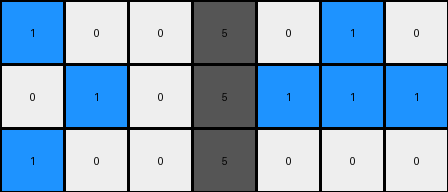

002 • History
=============

.. meta::
   :puzzle_id: 6-0520fde7
   :timestamp: 24.305.235334
   :call_count: 2

Begin puzzle: 6-0520fde7

**example_1**

**input**

.. code-block::

    [[1 0 0 5 0 1 0]
     [0 1 0 5 1 1 1]
     [1 0 0 5 0 0 0]]

**output**

.. code-block::

    [[0 0 0]
     [0 2 0]
     [0 0 0]]

.. image:: _images/002-4.png
   :alt: Grid visualization
   :align: center

**observations**

**Example 1 Analysis**

**Input:**

*   width: 7
*   height: 3
*   colors:
    *   0: (11)
    *   1: (5)
    *   5: (3)
*   objects: A central column of three '5's, surrounded by a pattern of '1's and '0's

**Output:**

*   width: 3
*   height: 3
*   colors:
    *   0: (8)
    *   2: (1)
*   objects: A single '2' in the center.

**Differences:**

*   cells_changed: 23
*   colors_changed: Input grid colors are replaced by a smaller grid with mostly '0's and a single '2'.  The size and shape of the output grid has also changed significantly.

**Transformation:**

The transformation is not immediately obvious. The input grid is much larger and has many more colors, while the output grid is smaller and much simpler.  There's no obvious relationship between the positions or counts of colors in the input and output.  A potential area to investigate is to see if the presence of the number '5' in the input triggers the generation of the '2' in the output.  More examples are needed to determine any systematic relationship.

I need more examples to understand the transformation rule.  The current example provides insufficient data to establish a pattern for prediction.

**example_2**

**input**

.. code-block::

    [[1 1 0 5 0 1 0]
     [0 0 1 5 1 1 1]
     [1 1 0 5 0 1 0]]

.. image:: _images/002-5.png
   :alt: Grid visualization
   :align: center

**output**

.. code-block::

    [[0 2 0]
     [0 0 2]
     [0 2 0]]

.. image:: _images/002-6.png
   :alt: Grid visualization
   :align: center

**observations**

- review the example grids

- check for differences and patterns

.. seealso::

   - :doc:`002-prompt`
   - :doc:`002-response`

